# Jarkom-Modul-1-A09-2023
**Praktikum Jaringan Komputer Modul 1 Tahun 2023**

## Author
| Nama | NRP |Github |
|---------------------------|------------|--------|
|Muhammad Zien Zidan | 5025211122 | hhttps://github.com/zienzidan |
|Glenaya | LupaNRPmu wkwk | https://github.com/nyawnayaw05 |


### Soal 1
> User melakukan berbagai aktivitas dengan menggunakan protokol FTP. Salah satunya adalah mengunggah suatu file.

Dalam konteks ini, tugas kita adalah mengidentifikasi aktivitas pengguna yang terfokus pada tindakan "mengunggah file". Tindakan ini dapat dikaitkan dengan operasi ``STOR`` yang biasanya terkait dengan transfer file dalam lingkungan komputer. Dengan demikian, kita dapat melacak paket-paket yang mengandung permintaan (request) dan tanggapan (response) terkait dengan aktivitas ini dengan cara memfilter = ``ftp``. Informasi ini dapat ditemukan pada paket nomor ``147`` dan ``149``.

> A. Berapakah sequence number (raw) pada packet yang menunjukkan aktivitas tersebut? 

Dalam pertanyaan ini, tugas kita adalah mengidentifikasi nomor urut ``sequence number`` yang terkandung dalam permintaan ``STOR``. Untuk mengetahui informasi ini, kita perlu melihat bagian ``Transmission Control Protocol`` pada ``paket-147`` yang tersedia. Dengan melakukan ini, kita akan dapat menemukan jawaban yang dibutuhkan yaitu ``258040667``.

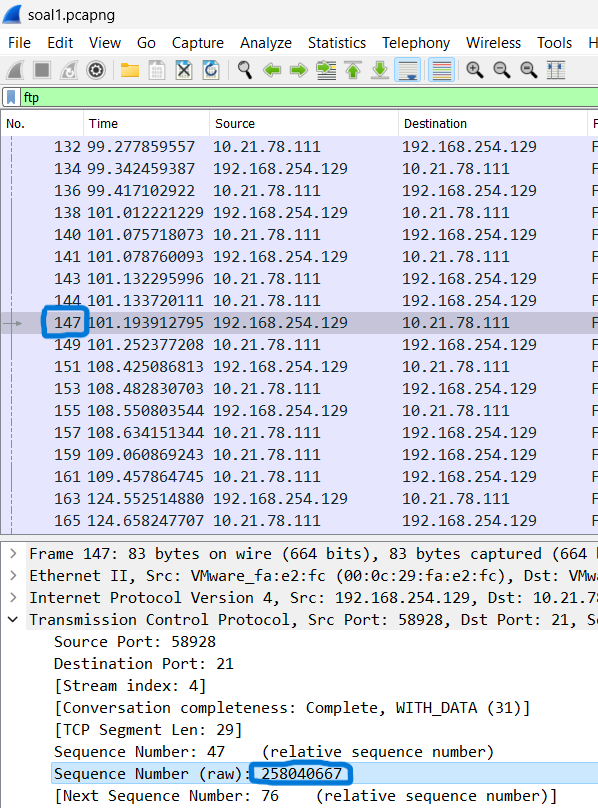

> B. Berapakah acknowledge number (raw) pada packet yang menunjukkan aktivitas tersebut?

Di bagian yang sama, Anda dapat menemukan ``Acknowledgment number (raw)`` setelah nilai yang telah disebutkan sebelumnya pada pertanyaan sebelumnya ditemukan nilainya adalah ``1044861039``.

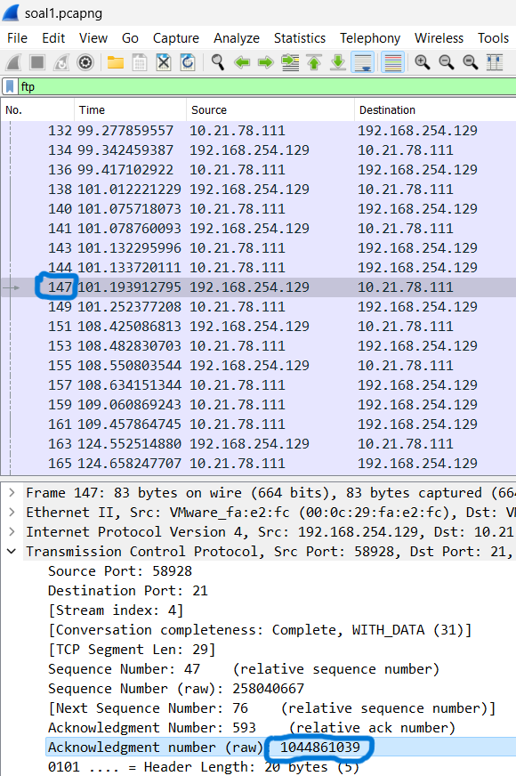

> C. Berapakah sequence number (raw) pada packet yang menunjukkan response dari aktivitas tersebut?

Untuk pertanyaan ini, kita perlu mengakses respons dari keberhasilan aktivitas ``STOR`` pada paket ``ke-149``. Seperti yang telah disebutkan sebelumnya, kita akan mengetahui bagian ``Transmission Control Protocol`` untuk menemukan nilai yang di inginkan di sana yaitu ``1044861039``.

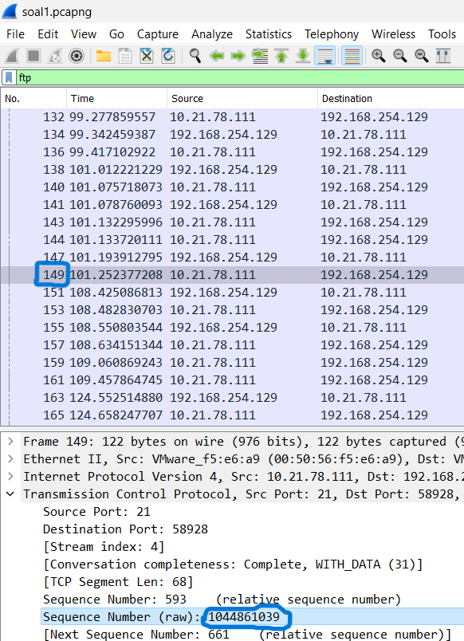

> D. Berapakah acknowledge number (raw) pada packet yang menunjukkan response dari aktivitas tersebut?

Dalam pertanyaan terakhir ini, tugas kita adalah menemukan ``Acknowledgment number (raw)`` yang terletak di bawah nilai yang sudah kita temukan pada respons aktivitas STOR sebelumnya yaitu ``258040667``.

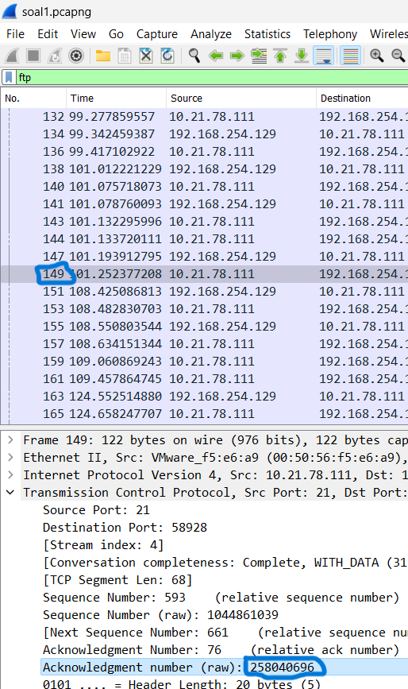

> Hasil Run

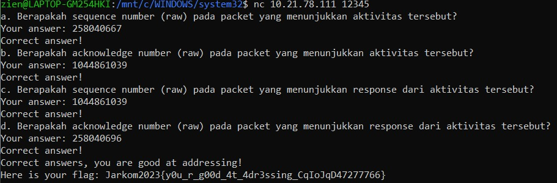

### Soal 2
> Sebutkan web server yang digunakan pada portal praktikum Jaringan Komputer!

Dalam Menjawab soal ini, kita perlu mengidentifikasi server yang digunakan dalam portal praktikum Jaringan Komputer, kita perlu mengamati protokol paket dalam file soal2.pcapng. Di sini, kita akan fokus pada satu paket dengan protokol TCP dengan memfilter ``ip.addr == 10.21.78.111``. Kemudian, langkah berikutnya adalah dengan mengklik kanan paket tersebut, lalu memilih opsi ``Follow`` dan lanjutkan dengan memilih ``TCP Stream``. Hasilnya akan menampilkan permintaan yang telah dijalankan,  sehingga kita dapat melihat detail server yang digunakan. Yaitu kita temukan kalo web server yang digunakan adalah ``gunicorn``.


.png)

> Hasil Run

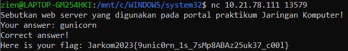

### Soal 3
> Dapin sedang belajar analisis jaringan. Bantulah Dapin untuk mengerjakan soal berikut:

> A. Berapa banyak paket yang tercapture dengan IP source maupun destination address adalah 239.255.255.250 dengan port 3702?

Untuk menghitung jumlah paket yang telah ditangkap dengan alamat sumber (source address) dan tujuan (destination address) ``239.22.22.250``, serta port ``3702``, kita dapat menggunakan filter query. Gunakan ``ip.src`` atau ``ip.dst`` untuk alamat dan ``udp.port`` untuk port yang diinginkan. Dalam konteks ini, kita perlu menerapkan filter query ``(ip.src == 239.255.255.250 or ip.dst == 239.255.255.250) && udp.port ==3702``. Hasilnya akan menampilkan semua paket yang sesuai dengan filter query. Setelah dihitung, totalnya adalah ``21`` paket.

> B. Protokol layer transport apa yang digunakan?

Dalam konteks pertanyaan ini, protokol yang tengah digunakan adalah ``UDP``, sebagaimana teridentifikasi dari hasil sebelumnya.

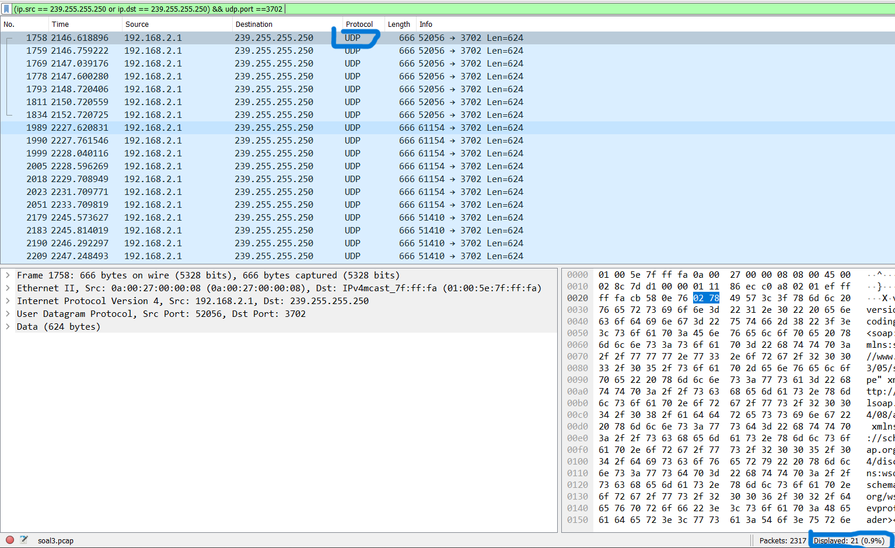

> Hasil Run

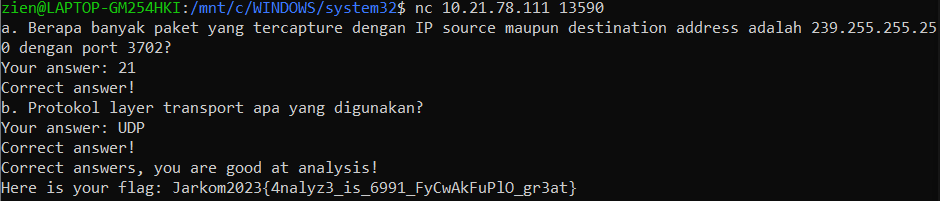

### Soal 4
> Berapa nilai checksum yang didapat dari header pada paket nomor 130?

Dalam soal ini, kita harus menemukan paket yang merupakan paket ``ke-130``. Setelah kita berhasil menemukannya, langkah selanjutnya adalah mengamati bagian ``User Datagram Protocol`` yang terletak di sudut kiri bawah. Di sana, kita dapat menemukan nilai checksum yang tercatat adalah ``0x18e5``.

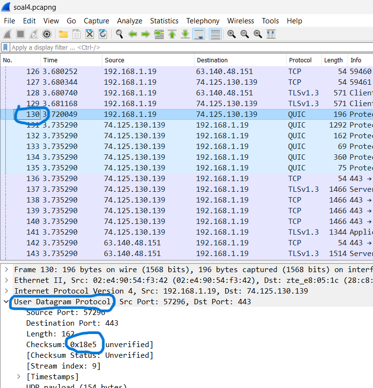

> Hasil Run

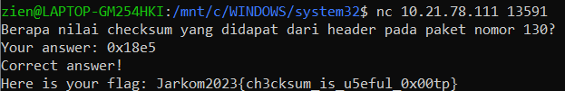

### Soal 5
> Elshe menemukan suatu file packet capture yang menarik. Bantulah Elshe untuk menganalisis file packet capture tersebut.


### Soal 6
> Seorang anak bernama Udin Berteman dengan SlameT yang merupakan seorang penggemar film detektif. sebagai teman yang baik, Ia selalu mengajak slamet untuk bermain valoranT bersama. suatu malam, terjadi sebuah hal yang tak terdUga. ketika udin mereka membuka game tersebut, laptop udin menunjukkan sebuah field text dan Sebuah kode Invalid bertuliskan **"server SOURCE ADDRESS 7812 is invalid"**. ketika ditelusuri di google, hasil pencarian hanya menampilkan a1 e5 u21. jiwa detektif slamet pun bergejolak. bantulah udin dan slamet untuk menemukan solusi kode error tersebut.

Untuk menyelesaikan tantangan ini, kita perlu fokus pada pola dekripsi yang diberikan, yaitu ``a1 e5 u21`` dan ``SUBTITUSI``, karena inilah kunci untuk menguraikan informasi yang tersedia. Setelah kita memahami pola yang diberikan, selanjutnya kita harus menekankan bagian yang ditebalkan dalam pertanyaan, yaitu ``SOURCE ADDRESS 7812``. Tugas kita adalah menemukan paket dengan nomor urut ``7812``.

Kemudian, kita perlu berfokus pada istilah ``SOURCE ADDRESS`` yang merujuk pada alamat sumber (source address) dalam format ``ip source`` yang terdapat dalam informasi tersebut. Langkah terakhir, kita dapat mengonversi rangkaian angka dari alamat sumber ini menjadi beberapa angka, mengingat bahwa kita hanya memiliki ``26 huruf`` dari hasil **subtitusi** tersebutdalam alfabet.

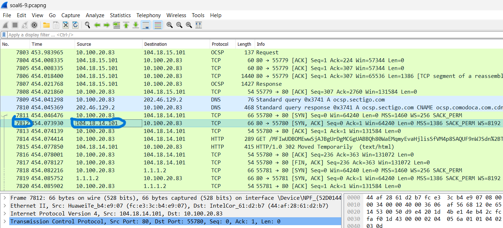

Gabungkan ``ip source`` yang kita temukan di paket ``7812``
```
1041814101
```

Lalu kita dapat pecah menjadi angka yang ``<= 26``
```
10 4 18 14 10 1
```

Dari situ kita dapat membentuk suatu kata dari pola yang telah ditemukan yaitu ``JDRNJA``

> Hasil Run

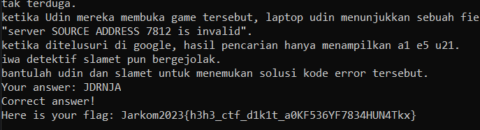

### Soal 7
> Berapa jumlah packet yang menuju IP 184.87.193.88?


### Soal 8
> Berikan kueri filter sehingga wireshark hanya mengambil semua protokol paket yang menuju port 80! (Jika terdapat lebih dari 1 port, maka urutkan sesuai dengan abjad)

### Soal 9
> Berikan kueri filter sehingga wireshark hanya mengambil paket yang berasal dari alamat 10.51.40.1 tetapi tidak menuju ke alamat 10.39.55.34!


### Soal 10
> Sebutkan kredensial yang benar ketika user mencoba login menggunakan Telnet


Untuk mengakses kredensial suatu akun, Kita telah menggunakan alat bantu ``TELNET`` dalam filter tangkap (capture filter) kita. kita melakukan pemeriksaan pada setiap paket secara berurutan, dimulai dari yang terbesar. Ini karena paket-paket kecil atau nomor kecil cenderung tidak mengandung informasi yang relevan, sementara paket-paket besar lebih mungkin mengandung kredensial yang dicari. Hasil penelusuran kita mengungkapkan bahwa kredensial ``Password`` ditemukan pada ``paket nomor 81``. Berikut ini adalah ``Password`` yang berhasil kita temukan. 

Selanjutnya, setelah kita mendapatkan ``Password`` tersebut, langkah selanjutnya adalah memasukkannya ke dalam aplikasi ``Netcat`` dengan format ``[USERNAME]:[PASSWORD]`` adalah ``dhafin:kesayangannyak0k0``

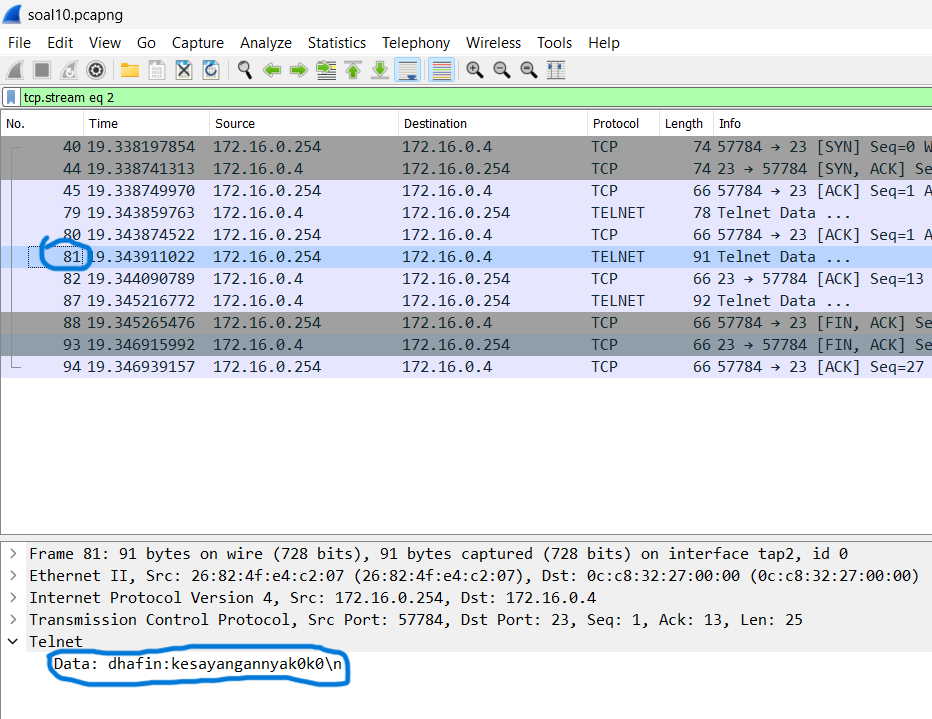

> Hasil Run

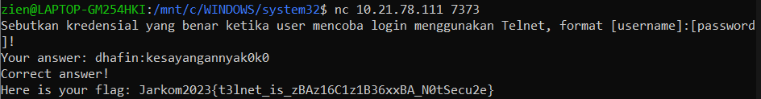